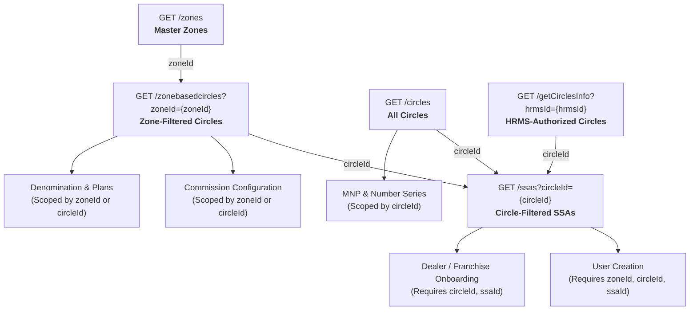
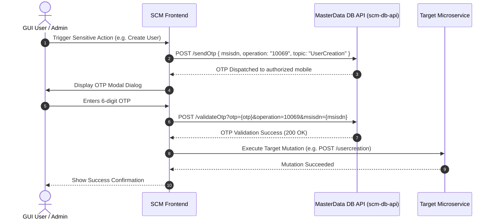

# SCM API Architecture & Endpoint Mapping

This document provides a comprehensive technical analysis of the **SCM Postman API Collection** (`SCM_APIs.postman_collection.json`). It details microservice topologies, CRUD classifications, required path/query/body parameters, OTP validation protocols, and hierarchical dependencies across the system.

---

## 1. Executive Summary & Microservice Architecture

The Postman collection contains **126 total requests** organized across 5 functional folders. These represent **71 unique HTTP routes** across 6 backend microservices. The difference between total collection requests and unique routes arises because:
1. **Context-Specific OTP Triggering**: The collection provisions dedicated `sendOtp` items for each distinct mutation, each pre-configured with that mutation's unique `topic` (e.g. `UserCreation`, `PrepaidFrc`, `DealerStatus`).
2. **Localized Master Data Test Suites**: Master data queries like `Get Circles Info (by HRMS)`, `Get Zone Based Circles`, and `Get Category` are duplicated across module folders so QA and developers can run isolated folder-level test collections.
3. **Variant Payloads**: Endpoints like `saveMultipleCommissionConfig` and `saveMultipleDenominations` are represented multiple times to test global (`zoneId=0`) vs. zone-specific scoping.

### Microservices Base Path Mapping

| Service Identifier | Base URL Path / Context | Functional Responsibility |
| :--- | :--- | :--- |
| **`scm-user-api`** | `/scm-user-api/scm-user-api/` | User lifecycle, authentication, status, HRMS circle scoping, RBAC permissions |
| **`scm-dealer-api`** | `/scm-dealer-api/scm-dealer-api/` | Dealer & Franchise onboarding, KYC validation, hierarchy management, MPIN reset |
| **`scm-plans-api`** | `/scm-plans-api/scm-product-api/` | Product catalog, plan definitions, denominations, and commission rule configurations |
| **`scm-db-api`** | `/scm-db-api/masterdata-db-api/` | Geographic data (Zone/Circle/SSA), tax/categories, MNP registry, number series, centralized OTP engine |
| **`scmfmis-reports-api`** | `/scmfmis-reports-api/scm-franchise-gui/` | Franchise operational reports, franchise balance top-up approvals and rejections |
| **`scm-stock-api`** | `/scm-stock-api/stock-api/` | Inventory, wallet balance adjustments (C-TOPUP, Promo, etc.) |

---

## 2. Shared Dependencies Architecture (`Zone → Circle → SSA`)

The SCM platform enforces strict geographic and organizational scoping. High-level administrative users configure global or zone-wide entities, while operational users and dealers operate strictly within assigned Circles or SSAs.

### Geographic Cascade Flow



### Dependency Chain Specifications

1. **Zone (`zoneId`)**:
   - Provider: `GET /scm-db-api/masterdata-db-api/zones`
   - Returns: List of operational zones (e.g., East, West, North, South).
   - Scopes: Zone-wide commission rules, zone-wide denomination matrices (`zoneId=0` indicates all circles across the country).
2. **Circle (`circleId`)**:
   - Providers:
     - Global Circles: `GET /scm-db-api/masterdata-db-api/circles`
     - Zone-dependent Circles: `GET /scm-db-api/masterdata-db-api/zonebasedcircles?zoneId={zoneId}`
     - HRMS User-filtered Circles: `GET /scm-user-api/scm-user-api/getCirclesInfo?hrmsId={hrmsId}`
   - Scopes: Plans, MNP entries, Number series, Commissions, Dealer allocations, User jurisdictions.
3. **Secondary Switching Area / SSA (`ssaId`)**:
   - Provider: `GET /scm-db-api/masterdata-db-api/ssas?circleId={circleId}`
   - Scopes: Granular administrative boundary inside a circle. Required for User Creation and Dealer/Franchise Onboarding.

### Business & Taxonomic Dependencies

| Dependent Flow | Provider Endpoints | Consumer Endpoint | Required Mapping Parameters |
| :--- | :--- | :--- | :--- |
| **Dealer Classification** | `GET /dealerType`<br/>`GET /getCategoryByDealer/{dealerType}` | `Create Dealer`<br/>`Update Dealer` | `dealerType` → selects category list → yields `categoryId` |
| **Dealer Hierarchy Change** | `GET /dealerWithMobile?msisdn={srcMsisdn}`<br/>`GET /dealerWithMobile?msisdn={destMsisdn}` | `POST /changeDealerHierarchy` | `srcMsisdn` (child), `parentMsisdn` (new parent), `type` |
| **Franchise Balance Approval** | `GET /franchiseAddBalanceTransactions?circle={circleId}` | `POST /franchiseAddBalance/approve`<br/>`POST /franchiseAddBalance/reject` | List of `fabSeq` transaction identifiers → `fabSeqList` |
| **Plan / Commission Rules** | `GET /getCategory`<br/>`GET /rechargePlan?price=&circleId=&planType=` | `POST /saveCommissionConfig`<br/>`POST /saveDenomination` | `categoryId`, `circleId`, `planType`, `denomination` |

---

## 3. OTP-Protected Mutations Architecture

All sensitive write, modify, status change, and financial actions are guarded by a **two-phase OTP verification handshake** handled centrally by `scm-db-api`.

### Two-Phase OTP Flow



### Complete OTP Topic & Operation Registry

The universal operation identifier across all modules is `operation = "10069"`.

| Domain | Target Mutation Action | Method & Target Path | OTP Topic (`topic`) |
| :--- | :--- | :--- | :--- |
| **User** | User Onboarding | `POST /scm-user-api/usercreation` | `UserCreation` |
| **User** | Modify User Details | `POST /scm-user-api/modifyUser` | `Modifyuseredit` |
| **User** | Modify Permissions | `POST /scm-user-api/modifyPermissions` | `Modifyuserpermission` |
| **User** | Change User Status | `POST /scm-user-api/userStatusChangewithHrmsIdandUsername` | `Modifyuserstatus` |
| **User** | Password Change | `POST /scm-user-api/changePassword` | `ChangePassword` |
| **Dealer** | Create Dealer / Franchise | `POST /scm-dealer-api/createDealer` | `Dealercreation` |
| **Dealer** | Modify Dealer Details | `POST /scm-dealer-api/updateDealer` | `Modifydealer` |
| **Dealer** | Change Dealer Status | `POST /scm-dealer-api/dealerStatusChange` | `DealerStatus` |
| **Dealer** | Transfer Hierarchy | `POST /scm-dealer-api/changeDealerHierarchy` | `DealerHierarchyChange` |
| **Dealer** | Reset Dealer MPIN | `PUT /scm-dealer-api/resetMpin` | `DealerMpinreset` |
| **Plans** | Add New Product Plan | `POST /scm-product-api/addplan` | `Addnewplan` / `Addplan` |
| **Plans** | Save Denomination Matrix | `POST /scm-product-api/saveDenomination`<br/>`POST /saveMultipleDenominations` | `Denominationconfiguration` |
| **Plans** | Add MNP Entry | `POST /masterdata-db-api/savemnp` | `ADD MNP` |
| **Plans** | Modify MNP Entry | `POST /masterdata-db-api/modifyMnpData` | `ModifyMnp` |
| **Plans** | Delete MNP Entry | `POST /masterdata-db-api/deleteMnp` | `DeleteMnp` |
| **Plans** | Add Number Series | `POST /masterdata-db-api/addnumberseries` | `AddnumberSeries` |
| **Plans** | Edit / Save Number Series | `POST /masterdata-db-api/saveNumberSeries`<br/>`PUT /editnumberseries` | `ModfifynumberSeries` |
| **Plans** | Purge Number Series | `DELETE /masterdata-db-api/purgenumberseries` | `DeleteNumberseries` |
| **Commission** | Save Prepaid FRC Commission | `POST /scm-product-api/saveCommissionConfig` | `PrepaidFrc` |
| **Commission** | Save Bulk / OTF Commission | `POST /scm-product-api/savemultipleCommissionConfig` | `PrepaidOtf` |
| **Commission** | Save Postpaid Commission | `POST /scm-product-api/postpaidCommissionConfig` | `Postpaid` |
| **Commission** | Save Landline Commission | `POST /scm-product-api/landlineCommissionConfig` | `Landline` |
| **Commission** | Update Prepaid FRC Commission | `POST /scm-product-api/updateCommissionConfig` | `Modify_PrepaidFRC` |
| **Commission** | Update Prepaid OTF Commission | `POST /scm-product-api/updateCommissionConfig` | `Modify_PrepaidOTF` |
| **Commission** | Update Postpaid Commission | `POST /scm-product-api/updatePostpaidCommission` | `Modify_Postpaid` |
| **Commission** | Update Landline Commission | `POST /scm-product-api/updateLandlineCommission` | `Modify_Landline` |
| **Commission** | Delete Commission Config | `POST /deleteCommissionConfig`<br/>`POST /deletePostpaidCommission`<br/>`POST /deleteLandlineCommission` | `DeleteprepaidOtf` |
| **Commission** | Approve Franchise Balance Top-Up | `POST /franchiseAddBalance/approve` | `FranchiseAddbalanceApprove` |
| **Commission** | Reject Franchise Balance Top-Up | `POST /franchiseAddBalance/reject` | `FranchiseAddbalanceReject` |

---

## 4. Domain API Tables

### Legend
- **CRUD**: `[C]` Create, `[R]` Read/Query, `[U]` Update, `[D]` Delete/Purge, `[A]` Action/Execute
- **Param Types**: `(P)` Path Variable, `(Q)` Query Parameter, `(B)` Request Body JSON, `(F)` Multipart FormData

---

### 4.1. User Management Domain (`user`)

Manages GUI portal accounts, role allocations, circle authorization, user status (Active/Inactive), granular RBAC permission matrices, and security credentials.

| Endpoint Name | Method | Path / Route | CRUD | Required & Key Fields | OTP Protected | Dependencies |
| :--- | :--- | :--- | :--- | :--- | :--- | :--- |
| **Fetch Username Availability** | `GET` | `/scm-user-api/scm-user-api/fetchusername` | `[R]` | `(Q)` `username` | No | None |
| **Fetch User by Username** | `GET` | `/scm-user-api/scm-user-api/getUser/{username}` | `[R]` | `(P)` `username` | No | `username` |
| **Get User by HRMS & Username** | `GET` | `/scm-user-api/scm-user-api/getUserwithHrmsIdandUsername` | `[R]` | `(Q)` `hrmsId`, `username`, `guiUsername` | No | `hrmsId`, `username` |
| **User Status Check** | `GET` | `/scm-user-api/scm-user-api/userStatusCheck` | `[R]` | `(Q)` `username` | No | `username` |
| **Get User Permissions** | `GET` | `/scm-user-api/scm-user-api/getUserPermissionwithHrmsIdandUsername` | `[R]` | `(Q)` `hrmsId`, `username`, `guiUsername` | No | `hrmsId`, `username` |
| **Create User** | `POST` | `/scm-user-api/scm-user-api/usercreation` | `[C]` | `(B)` `userId`, `hrmsId`, `username`, `mobileNumber`, `createdBy`, `firstName`, `lastName`, `address`, `status`, `roleId`, `zoneId`, `circleId`, `ssaId`, `dob`, `password`, `userIpAddress`, `expiredate`, `permissions` (nested object) | **Yes**<br/>`UserCreation` | `zoneId`, `circleId`, `ssaId`, `roleId` |
| **Modify User** | `POST` | `/scm-user-api/scm-user-api/modifyUser` | `[U]` | `(B)` `username`, `hrmsId` | **Yes**<br/>`Modifyuseredit` | `username`, `hrmsId` |
| **Modify Permissions** | `POST` | `/scm-user-api/scm-user-api/modifyPermissions` | `[U]` | `(Q)` `guiUser`<br/>`(B)` `username`, plus permission flags | **Yes**<br/>`Modifyuserpermission` | `username` |
| **Change User Status** | `POST` | `/scm-user-api/scm-user-api/userStatusChangewithHrmsIdandUsername` | `[U]` | `(Q)` `hrmsId`, `username`, `guiUsername`, `status` | **Yes**<br/>`Modifyuserstatus` | `hrmsId`, `username` |
| **Change Password** | `POST` | `/scm-user-api/scm-user-api/changePassword` | `[A]` | `(B)` `hrmsId`, `username`, `oldPassword`, `newPassword`, `operation` | **Yes**<br/>`ChangePassword` | `username`, `hrmsId` |
| **Logout** | `GET` | `/scm-user-api/scm-user-api/scmlogout` | `[A]` | `(Q)` `username` | No | Active session |

#### User Permission Matrix Schema (`permissions` object)
In `usercreation` and `modifyPermissions`, permissions are configured via a 38-flag RBAC boolean/integer bitmask:
```json
{
  "roleId": 3,
  "username": "user@gmail.com",
  "hrmsId": "123456",
  "dealerPermissions": 1,
  "walletPermissions": 1,
  "userPermissions": 1,
  "commissionPermissions": 1,
  "plansNumberpermissions": 1,
  "reportsPermissions": 1,
  "stockCheck": 1,
  "dealerMpinReset": 1,
  "franchiseAddBalance": 1,
  "bulkRecharge": 1,
  "varepReports": 1,
  "userActivityReports": 1,
  "dealerStatus": 1,
  "transactionStatus": 1,
  "topupReversal": 1,
  "simSaleUpload": 1,
  "simInventory": 1,
  "pendingClearence": 1,
  "inReconsilation": 1,
  "mobileApp": 1,
  "deferredCommission": 1,
  "cbp": 1,
  "simUpgrade": 1,
  "mnp": 1,
  "frcStv": 1,
  "bulk_purge": 1,
  "e_auction": 1,
  "caf_postpaid": null,
  "denominations": 1,
  "prepaidCommissions": 1,
  "postpaidCommissions": 1,
  "landlineCommissions": 1,
  "FOSCreation": 1
}
```

---

### 4.2. Dealer Management Domain (`dealer`)

Handles multi-tier channel distribution entities (Franchises, Sub-Franchises, Retailers, FOS), KYC document onboarding, status lifecycle, network tree traversal, parent-child hierarchy reallocation, and security MPIN resets.

| Endpoint Name | Method | Path / Route | CRUD | Required & Key Fields | OTP Protected | Dependencies |
| :--- | :--- | :--- | :--- | :--- | :--- | :--- |
| **Fetch Dealer (Search)** | `GET` | `/scm-dealer-api/scm-dealer-api/fetchDealer` | `[R]` | `(Q)` `mobile` (msisdn), `gui_username` | No | `msisdn` |
| **Fetch Dealer Data** | `GET` | `/scm-dealer-api/scm-dealer-api/fetchDealerData` | `[R]` | `(Q)` `msisdn`, `gui_username` | No | `msisdn` |
| **Fetch Dealer by MSISDN** | `GET` | `/scm-dealer-api/scm-dealer-api/dealer/{msisdn}` | `[R]` | `(P)` `msisdn` | No | `msisdn` |
| **Dealer Tree / List** | `GET` | `/scm-dealer-api/scm-dealer-api/dealerList` | `[R]` | `(Q)` `msisdn`, `username` | No | `msisdn` |
| **Dealer Status Check** | `GET` | `/scm-dealer-api/scm-dealer-api/dealerStatusCheck` | `[R]` | `(Q)` `msisdn` | No | `msisdn` |
| **Check Dealer by PAN** | `GET` | `/scm-dealer-api/scm-dealer-api/checkDealerByPan` | `[R]` | `(Q)` `panId` | No | PAN number |
| **Check Dealer by Aadhaar** | `GET` | `/scm-dealer-api/scm-dealer-api/checkDealerByAadhar` | `[R]` | `(Q)` `aadharId` | No | Aadhaar number |
| **Get Franchise by Mobile** | `GET` | `/scm-dealer-api/scm-dealer-api/franchise` | `[R]` | `(Q)` `msisdn` (`franchiseMsisdn`) | No | `msisdn` |
| **Get SubFranchise by Mobile** | `GET` | `/scm-dealer-api/scm-dealer-api/subFranchise` | `[R]` | `(Q)` `msisdn` (`subFranchiseMsisdn`) | No | `msisdn` |
| **Dealer With Mobile (Source/Dest)** | `GET` | `/scm-dealer-api/scm-dealer-api/dealerWithMobile` | `[R]` | `(Q)` `msisdn`, `guiUsername` | No | `msisdn` |
| **Create Dealer / Franchise** | `POST` | `/scm-dealer-api/scm-dealer-api/createDealer` | `[C]` | `(F)` `dealer` (JSON file payload), `certificate` (KYC attachment file) | **Yes**<br/>`Dealercreation` | `circleId`, `ssaId`, `dealerType`, `categoryId` |
| **Update Dealer** | `POST` | `/scm-dealer-api/scm-dealer-api/updateDealer` | `[U]` | `(B)` `dealerId`, `dealerCode`, `scmMsisdn`, `firstName` | **Yes**<br/>`Modifydealer` | `dealerId`, `scmMsisdn` |
| **Change Dealer Status** | `POST` | `/scm-dealer-api/scm-dealer-api/dealerStatusChange` | `[U]` | `(Q)` `msisdn`, `username`, `status` | **Yes**<br/>`DealerStatus` | `msisdn` |
| **Change Dealer Hierarchy** | `POST` | `/scm-dealer-api/scm-dealer-api/changeDealerHierarchy` | `[U]` | `(Q)` `srcMsisdn`, `parentMsisdn` (`destMsisdn`), `guiUsername`, `type` | **Yes**<br/>`DealerHierarchyChange` | `srcMsisdn`, `destMsisdn` |
| **Reset Dealer MPIN** | `PUT` | `/scm-dealer-api/scm-dealer-api/resetMpin` | `[A]` | `(Q)` `msisdn`, `username` | **Yes**<br/>`DealerMpinreset` | `msisdn` |
| **Purge Dealer** | `POST` | `/scm-dealer-api/scm-dealer-api/purgeDealer` | `[D]` | `(Q)` `msisdn`, `username` | No | `msisdn` |

---

### 4.3. Plans & Number Configuration Domain (`plans`)

Covers the full lifecycle of product plans, talk value / validity matrices, recharge denominations, Mobile Number Portability (MNP) routing, and telecom number series allocations.

| Endpoint Name | Method | Path / Route | CRUD | Required & Key Fields | OTP Protected | Dependencies |
| :--- | :--- | :--- | :--- | :--- | :--- | :--- |
| **Download / Get Plans** | `GET` | `/scm-plans-api/scm-product-api/getplans` | `[R]` | None | No | None |
| **Add Plan** | `POST` | `/scm-plans-api/scm-product-api/addplan` | `[C]` | `(Q)` `username`<br/>`(B)` `operator`, `denomination`, `talkvalue`, `country`, `start_date`, `end_date`, `type`, `description`, `tab_name`, `circle`, `validity`, `from_date`, `to_date` | **Yes**<br/>`Addnewplan` / `Addplan` | `circle` |
| **Update Plan** | `PUT` | `/scm-plans-api/scm-product-api/updateplan/{sno}` | `[U]` | `(P)` `sno`<br/>`(Q)` `username`<br/>`(B)` `sno` | No | `sno` |
| **Delete Plan** | `DELETE` | `/scm-plans-api/scm-product-api/deleteplan/{sno}` | `[D]` | `(P)` `sno`<br/>`(Q)` `username` | No | `sno` |
| **Fetch Recharge Plan** | `GET` | `/scm-plans-api/scm-product-api/rechargePlan` | `[R]` | `(Q)` `price`, `circleId`, `planType` | No | `circleId` |
| **Save Denomination** | `POST` | `/scm-plans-api/scm-product-api/saveDenomination` | `[C]` | `(B)` `rechargePlanName`, `planType`, `price`, `createdBy`, `validity`, `description`, `bundleName`, `bucketId`, `faceValue`, `netValue`, `cardGroup`, `varepDenom`, `circleId`, `vasDenom`, `varepGroup` | **Yes**<br/>`Denominationconfiguration` | `circleId` |
| **Save Multiple Denominations (All Circles / Zone 0)** | `POST` | `/scm-plans-api/scm-product-api/saveMultipleDenominations?zoneId=0` | `[C]` | `(Q)` `zoneId=0`<br/>`(B)` Same as `saveDenomination` | **Yes**<br/>`Denominationconfiguration` | `zoneId=0` |
| **Save Multiple Denominations (Zone Scoped)** | `POST` | `/scm-plans-api/scm-product-api/saveMultipleDenominations` | `[C]` | `(Q)` `zoneId`<br/>`(B)` Same as `saveDenomination` | **Yes**<br/>`Denominationconfiguration` | `zoneId` |
| **Find MNP Data** | `GET` | `/scm-db-api/masterdata-db-api/findMnpData` | `[R]` | `(Q)` `msisdn`, `username` | No | `msisdn` |
| **Save MNP** | `POST` | `/scm-db-api/masterdata-db-api/savemnp` | `[C]` | `(B)` `msisdn`, `recipientNo`, `circleId`, `username` | **Yes**<br/>`ADD MNP` | `circleId` |
| **Modify MNP Data** | `POST` | `/scm-db-api/masterdata-db-api/modifyMnpData` | `[U]` | `(B)` `msisdn`, `recipientNo`, `circleId`, `username` | **Yes**<br/>`ModifyMnp` | `circleId` |
| **Delete MNP** | `POST` | `/scm-db-api/masterdata-db-api/deleteMnp` | `[D]` | `(Q)` `msisdn`, `username`<br/>`(B)` `msisdn`, `recipientNo`, `circleId`, `username` | **Yes**<br/>`DeleteMnp` | `msisdn` |
| **Get Number Series** | `GET` | `/scm-db-api/masterdata-db-api/getnumberseries` | `[R]` | `(Q)` `username`, `series` (`numberSeries`) | No | `numberSeries` |
| **Add Number Series** | `POST` | `/scm-db-api/masterdata-db-api/addnumberseries` | `[C]` | `(Q)` `username`<br/>`(B)` `circleId`, `numberSeries`, `numberSeriesId`, `inId`, `username` | **Yes**<br/>`AddnumberSeries` | `circleId` |
| **Save Number Series (Edit)** | `POST` | `/scm-db-api/masterdata-db-api/saveNumberSeries` | `[U]` | `(B)` `zoneId`, `circleId`, `seqNo`, `number_series`, `inId`, `username` | **Yes**<br/>`ModfifynumberSeries` | `zoneId`, `circleId` |
| **Edit Number Series** | `PUT` | `/scm-db-api/masterdata-db-api/editnumberseries` | `[U]` | `(Q)` `username`<br/>`(B)` `numberSeries`, `inId`, `circleId`, `username`, `numberSeriesId` | **Yes**<br/>`ModfifynumberSeries` | `circleId` |
| **Purge Number Series** | `DELETE` | `/scm-db-api/masterdata-db-api/purgenumberseries` | `[D]` | `(Q)` `username`, `series` (`numberSeries`) | **Yes**<br/>`DeleteNumberseries` | `numberSeries` |

---

### 4.4. Commission Configuration Domain (`commission`)

Manages First Recharge (FRC), On-The-Fly (OTF), Postpaid, and Landline commission percentages, TDS withholding, channel tier splits (Franchise vs. Sub-Franchise vs. Retailer), and Franchise balance approvals.

| Endpoint Name | Method | Path / Route | CRUD | Required & Key Fields | OTP Protected | Dependencies |
| :--- | :--- | :--- | :--- | :--- | :--- | :--- |
| **Fetch Prepaid FRC Commission** | `GET` | `/scm-plans-api/scm-product-api/fetchCommission` | `[R]` | `(Q)` `denomination`, `circleId`, `categoryId`, `commissionType=1`, `username`, `dtype` | No | `circleId`, `categoryId` |
| **Fetch Prepaid OTF Commission** | `GET` | `/scm-plans-api/scm-product-api/fetchPrepaidOTFCommission` | `[R]` | `(Q)` `denomination`, `circleId`, `categoryId`, `commissionType`, `username`, `dtype` | No | `circleId`, `categoryId` |
| **Fetch Postpaid Commission** | `GET` | `/scm-plans-api/scm-product-api/fetchPostpaidCommission` | `[R]` | `(Q)` `circleId`, `category` (`categoryId`), `sellerLevel`, `username` | No | `circleId`, `categoryId` |
| **Fetch Landline Commission** | `POST` | `/scm-plans-api/scm-product-api/fetchLandlineCommission` | `[R]` | `(B)` `circleId`, `categoryId`, `fromAmount`, `toAmount`, `guiUsername` | No | `circleId`, `categoryId` |
| **Save Commission Config (FRC)** | `POST` | `/scm-plans-api/scm-product-api/saveCommissionConfig` | `[C]` | `(B)` `masterCategoryId`, `circleId`, `sellerCommission`, `fraCommission`, `subCommission`, `tds`, `denomination`, `categoryId`, `commissionType`, `dtype`, `createdGuiUser` | **Yes**<br/>`PrepaidFrc` | `circleId`, `categoryId` |
| **Save Multiple Commission Config (All Circles / Zone 0)** | `POST` | `/scm-plans-api/scm-product-api/savemultipleCommissionConfig?zoneId=0` | `[C]` | `(Q)` `zoneId=0`<br/>`(B)` Same as `saveCommissionConfig` | **Yes**<br/>`PrepaidOtf` | `zoneId=0` |
| **Save Multiple Commission Config (Zone Scoped)** | `POST` | `/scm-plans-api/scm-product-api/savemultipleCommissionConfig` | `[C]` | `(Q)` `zoneId`<br/>`(B)` Same as `saveCommissionConfig` | **Yes**<br/>`PrepaidOtf` | `zoneId` |
| **Postpaid Commission Config** | `POST` | `/scm-plans-api/scm-product-api/postpaidCommissionConfig` | `[C]` | `(B)` `categoryId`, `circleId`, `tdsAmount`, `fraCommission`, `subFraCommission`, `actualCommission`, `retailerCommission`, `sellerLevel`, `cap_limit`, `createdGuiUser`, `zoneId` | **Yes**<br/>`Postpaid` | `zoneId`, `circleId`, `categoryId` |
| **Landline Commission Config** | `POST` | `/scm-plans-api/scm-product-api/landlineCommissionConfig` | `[C]` | `(B)` `categoryId`, `circleId`, `tdsAmount`, `fraCommission`, `subFraCommission`, `retailerCommission`, `sellerLevel`, `commissionId`, `commissionAmount`, `fromAmount`, `toAmount`, `dtype`, `zoneId`, `createdGuiUser` | **Yes**<br/>`Landline` | `zoneId`, `circleId`, `categoryId` |
| **Update Commission Config** | `POST` | `/scm-plans-api/scm-product-api/updateCommissionConfig` | `[U]` | `(B)` `commissionId`, plus modified commission rates | **Yes**<br/>`Modify_PrepaidFRC` / `Modify_PrepaidOTF` | `commissionId` |
| **Update Postpaid Commission** | `POST` | `/scm-plans-api/scm-product-api/updatePostpaidCommission` | `[U]` | `(B)` `commissionId`, plus modified postpaid rates | **Yes**<br/>`Modify_Postpaid` | `commissionId` |
| **Update Landline Commission** | `POST` | `/scm-plans-api/scm-product-api/updateLandlineCommission` | `[U]` | `(B)` `commissionId`, plus modified landline rates | **Yes**<br/>`Modify_Landline` | `commissionId` |
| **Delete Commission Config** | `POST` | `/scm-plans-api/scm-product-api/deleteCommissionConfig` | `[D]` | `(Q)` `commissionId` | **Yes**<br/>`DeleteprepaidOtf` | `commissionId` |
| **Delete Postpaid Commission** | `POST` | `/scm-plans-api/scm-product-api/deletePostpaidCommission` | `[D]` | `(Q)` `commissionId` | **Yes**<br/>`DeleteprepaidOtf` | `commissionId` |
| **Delete Landline Commission** | `POST` | `/scm-plans-api/scm-product-api/deleteLandlineCommission` | `[D]` | `(Q)` `commissionId` | **Yes**<br/>`DeleteprepaidOtf` | `commissionId` |
| **Franchise Add Balance Transactions** | `GET` | `/scmfmis-reports-api/scm-franchise-gui/franchiseAddBalanceTransactions` | `[R]` | `(Q)` `circle` (`circleId`) | No | `circleId` |
| **Approve Franchise Add Balance** | `POST` | `/scmfmis-reports-api/scm-franchise-gui/franchiseAddBalance/approve` | `[A]` | `(B)` `fabSeqList` (array of sequence IDs), `actionUser` | **Yes**<br/>`FranchiseAddbalanceApprove` | `fabSeqList` |
| **Reject Franchise Add Balance** | `POST` | `/scmfmis-reports-api/scm-franchise-gui/franchiseAddBalance/reject` | `[A]` | `(B)` `fabSeqList` (array of sequence IDs), `actionUser` | **Yes**<br/>`FranchiseAddbalanceReject` | `fabSeqList` |

---

### 4.5. Master Data Domain (`master-data`)

The foundational backbone for system lookups: administrative geography, dealer taxonomies, category indices, and the centralized 2-step OTP dispatch/validation service.

| Endpoint Name | Method | Path / Route | CRUD | Required & Key Fields | OTP Protected | Dependencies |
| :--- | :--- | :--- | :--- | :--- | :--- | :--- |
| **Send OTP** | `POST` | `/scm-db-api/masterdata-db-api/sendOtp` | `[A]` | `(B)` `msisdn`, `operation` ("10069"), `topic` (Action Topic Name) | No (Dispatcher) | Target mobile number |
| **Validate OTP** | `POST` | `/scm-db-api/masterdata-db-api/validateOtp` | `[A]` | `(Q)` `otp`, `operation` ("10069"), `msisdn` | No (Validator) | Active OTP token |
| **Get Zones** | `GET` | `/scm-db-api/masterdata-db-api/zones` | `[R]` | None | No | None |
| **Get All Circles** | `GET` | `/scm-db-api/masterdata-db-api/circles` | `[R]` | None | No | None |
| **Get Zone Based Circles** | `GET` | `/scm-db-api/masterdata-db-api/zonebasedcircles` | `[R]` | `(Q)` `zoneId` | No | `zoneId` |
| **Get Circles Info (by HRMS)** | `GET` | `/scm-user-api/scm-user-api/getCirclesInfo` | `[R]` | `(Q)` `hrmsId` | No | `hrmsId` |
| **Get SSAs (by Circle)** | `GET` | `/scm-db-api/masterdata-db-api/ssas` | `[R]` | `(Q)` `circleId` | No | `circleId` |
| **Get Dealer Type** | `GET` | `/scm-db-api/masterdata-db-api/dealerType` | `[R]` | None | No | None |
| **Get Category (All)** | `GET` | `/scm-db-api/masterdata-db-api/getCategory` | `[R]` | None | No | None |
| **Get Category by Dealer** | `GET` | `/scm-db-api/masterdata-db-api/getCategoryByDealer/{dealerType}` | `[R]` | `(P)` `dealerType` | No | `dealerType` |

---

### 4.6. Wallet Management Domain (`wallet`)

Operational ledger adjustments for channel partner stock and C-TOPUP balances.

| Endpoint Name | Method | Path / Route | CRUD | Required & Key Fields | OTP Protected | Dependencies |
| :--- | :--- | :--- | :--- | :--- | :--- | :--- |
| **Wallet Adjustment** | `POST` | `/scm-stock-api/stock-api/walletAdjustment` | `[A]` | `(B)` `dlr_msisdn`, `adjustment_type` (1=Credit, 2=Debit), `adjustment_amount`, `wallet_type` (1=Main, 2=Promo), `gui_user`, `remarks` | No (Audit logged) | Dealer `msisdn`, Active Session |

---

## 5. Architectural Implications for Frontend Implementation

1. **Cascade Dropdown Engine**:
   The frontend must implement an interconnected cascading dropdown system:
   - Selecting a `Zone` must trigger `/zonebasedcircles?zoneId={id}`.
   - Selecting a `Circle` must trigger `/ssas?circleId={id}`.
   - Selecting a `Dealer Type` must trigger `/getCategoryByDealer/{type}`.
2. **Universal Modal Interceptor for OTP**:
   A higher-order React hook/interceptor (`useOtpMutation`) should encapsulate the 2-step OTP handshake:
   - Intercept the mutation trigger.
   - Call `/sendOtp` with the bound `topic` and logged-in user's MSISDN.
   - Display a global OTP entry dialog.
   - On submission, invoke `/validateOtp`.
   - Upon HTTP 200 verification, fire the actual mutation API call.
3. **Multi-Part Form Data Handling**:
   Dealer and Franchise creation (`/createDealer`) requires `multipart/form-data` with two distinct parts:
   - Part 1: `dealer` - JSON string / Blob representation of the dealer schema.
   - Part 2: `certificate` - Binary file upload (PDF/JPG/PNG) of the authorized signatory certificate.
4. **Scoping Guards**:
   Administrative roles (`roleId=1` / Zone Admin) can toggle between Single Circle and Zone-wide / All-Circulation (`zoneId=0`) configurations for Denominations and Commissions. Standard circle users must have the zone parameters locked to their session context.
